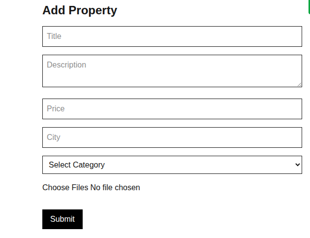
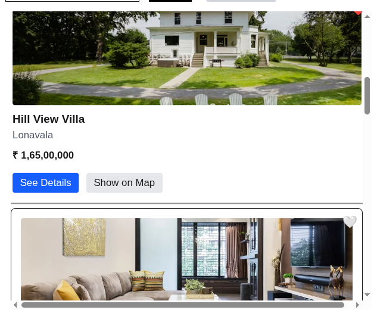
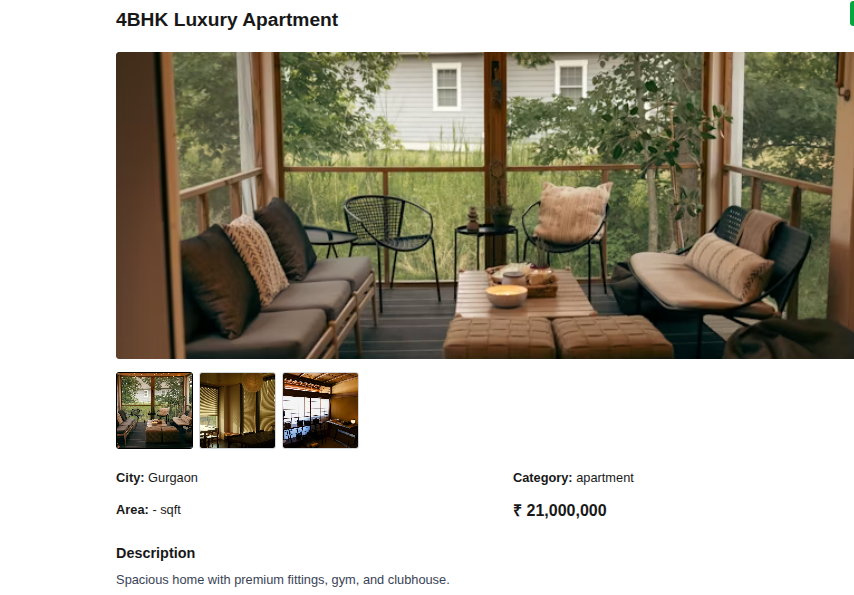
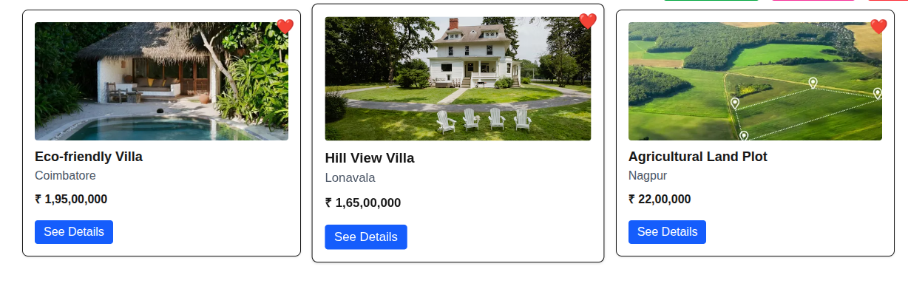
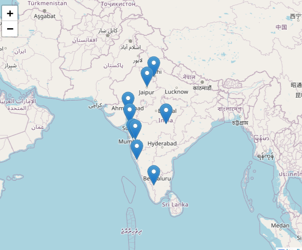

# 🏡 HomeHunt

HomeHunt is a modern full-stack real estate platform built with Next.js where users can explore properties, view them on interactive maps, upload listings with screenshots, and save favorite properties.

---

# 🚀 Features

## 🔐 Authentication
- Google Authentication using NextAuth
- Protected routes
- User-specific property management

---

## 🏠 Property Management
- Add property listings
- View property details
- Edit/Delete property (owner only)
- Property ownership protection

---

## 🖼️ Image Uploads
- Multiple image uploads
- Cloudinary integration
- Image preview before submission

---

## 🗺️ Map Integration
- Interactive Leaflet maps
- Property markers
- Highlight selected property
- Show property location on map

---

## ❤️ Favorites System
- Add/remove favorite properties
- Persistent favorite state
- Dedicated favorites page

---

## 🔎 Filters & Search
- City filter
- Category filter
- Price range filter

---

## 🎨 UI/UX
- Responsive design
- Toast notifications
- Loading states
- Optimistic UI updates

---

# 🛠️ Tech Stack

## Frontend
- Next.js 15+
- React
- TypeScript
- Tailwind CSS

---

## Backend
- Next.js API Routes
- MongoDB
- Mongoose

---

## Authentication
- NextAuth.js
- Google OAuth

---

## Maps & Media
- React Leaflet
- Cloudinary

---

# 📂 Folder Structure

```bash
src/
│
├── app/
|   ├── (main)
│   ├── api/
│   ├── favorites/
|   ├── global.css
|   ├── layout.tsx
|   └── page.tsx
│
├── components/
|   ├── AuthButton.tsx
|   ├── FavoriteButton.tsx
│   ├── Filters.tsx
│   ├── Map.tsx
|   ├── MapWrapper.tsx
│   ├── Pagination.tsx
│   ├── PropertyActions.tsx
│   ├── PropertyCard.tsx
|   ├── PropertyImages.tsx
│   ├── PropertyList.tsx
|   └── Providers.tsx
│   
├── context/
│   └── FavoritesContext.tsx
│
├── lib/
|   ├── auth.ts
|   ├── cloudinary.ts
│   ├── db.ts
|   ├── geocode.ts
│   └── mongodb.ts
│
└── models/
|   ├── Property.ts
|   └── User.ts
| 
|  
└── types
    └── next-auth.d.ts

```

---

# ⚙️ Environment Variables

Create a `.env.local` file in the root directory:

```env
MONGODB_URI=your_mongodb_connection

CLOUDINARY_CLOUD_NAME=your_cloud_name
CLOUDINARY_API_KEY=your_api_key
CLOUDINARY_API_SECRET=your_api_secret

GOOGLE_CLIENT_ID=your_google_client_id
GOOGLE_CLIENT_SECRET=your_google_client_secret

NEXTAUTH_SECRET=your_secret
NEXTAUTH_URL=http://localhost:3000

OPENCAGE_API_KEY=your_opencage_api_key


```

---

# 🚀 Getting Started

## 1️⃣ Clone Repository

```bash
git clone <your-repo-url>
```

---

## 2️⃣ Install Dependencies

```bash
npm install
```

---

## 3️⃣ Run Development Server

```bash
npm run dev
```

---

## 4️⃣ Open in Browser

```bash
http://localhost:3000
```

---

# 📸 Screenshots

Add screenshots after deployment:

- Home Page


- Properties Page


- Property Details


- Favorites Page


- Add Property Page


- Map View


---

# 🔒 Security Features

- Protected API routes
- Ownership validation
- Authenticated property actions
- Secure Cloudinary uploads

---

# 🔥 Future Improvements

- Admin dashboard
- Dark mode
- Skeleton loaders
- Property comparison
- Marker clustering
- Real-time chat
- Nearby radius search

---


---

# 👨‍💻 Author:Anveta Nangare
🔗 [GitHub](https://github.com/AnvetaDigital) 
